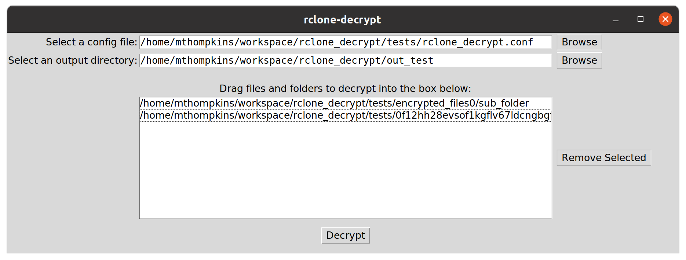

# rclone-decrypt
## Status


## Description
`rclone-decrypt` is a utility which will decrypt files that were encrypted with
[rclone](https://rclone.org/). The anticipated use-case is that a user has
independently downloaded an **encrypted** file or directory directly from a
remote cloud storage (Backblaze B2/Amazon Drive/Dropbox/etc...) and now wants to
decrypt it.

Given an rclone.conf file, this tool is simply a wrapper around `rclone` which
sets up a "local remote" to host the downloaded encrypted files and then calls
`rclone copy` in order to decrypt the files into a desired output folder.

Ostensibly I did this because my family backs-up our local NAS to a remote host
but the rest of my family prefers to download files one-off from the cloud host
and are not comfortable using the rclone CLI. This offers a CLI in addition to
an easy-to-use GUI to make life simple.

### Notes
* **Use at your own risk! Be sure you have copies of anything you're trying to
decrypt, just in case something goes wrong!**
* When decrypting files with encrypted filenames or folder names, the directory
  or filename must _only_ consist of the encrypted version. For example, if an
  encrypted file was downloaded as `path_to_encypted_file_4567asd8fasdf67asdf`
  where `4567asd8fasdf67asdf` is the encrypted part, the filename must be
  renamed to exclude the `path_to_encypted_file_` portion. Otherwise rclone will
  complain about invalid encryption names.
* Windows is supported thanks to the cross-platform nature of Flet.
* The GUI has been modernized using [Flet](https://flet.dev/), providing a cleaner look and better cross-platform support.

## Installation
```
pip3 install rclone-decrypt
```

## Requirements
### General
* `rclone` must be installed and available in your system's PATH.
    * **Windows Users:** Download `rclone` from [rclone.org](https://rclone.org/downloads/) and extract it. Then, add the directory containing `rclone.exe` to your System Environment Variables (PATH).

### Python environment
* `Python >= 3.10`

### Executable
**UNDER DEVELOPMENT**

## Usage
### CLI usage
```
> rclone-decrypt --config /path/to/rclone.conf --files /path/to/file/or/dir/
```

Example usages:
```
> rclone-decrypt --config rclone.conf --files /home/my_encrypted_dir
> rclone-decrypt --config rclone.conf --files /0f12hh28evsof1kgflv67ldcn/9g6h49o4ht35u7o5e4iv5a1h28
> rclone-decrypt --config rclone.conf --files /home/my_encrypted_file.bin
```
### GUI usage
If the python package is installed directly then the GUI can be invoked from the
command line, as shown below. Otherwise the packaged binary can be downloaded
and executed directly.
* Use the **Add Files** or **Add Folder** buttons to select items for decryption.
* Selected items will be listed in the main area. You can remove individual items using the "X" button.
* By default, decrypted files are saved to `~/Downloads/rclone-decrypted`.
* A default location for `rclone.conf` is provided automatically based on your OS, but you can browse for others.
```
rclone-decrypt --gui
```

#### Troubleshooting (Linux)
If you encounter an error like `libmpv.so.1: cannot open shared object file` on Linux (e.g., Ubuntu 24.04), you may need to install `libmpv2` and create a symlink:
```bash
sudo apt update && sudo apt install libmpv2
sudo ln -s /usr/lib/x86_64-linux-gnu/libmpv.so.2 /usr/lib/x86_64-linux-gnu/libmpv.so.1
```



## Development
```
python3 -m venv .venv
source .venv/bin/activate
poetry install
poetry run pytest
poetry run flake8
poetry run black src/ tests/
deactivate
```
